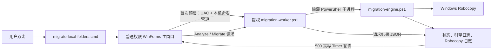

# 项目概览与代码审查

本文介绍 mklinktool 的运行结构、仓库文件职责和本次静态代码审查结果。程序目标是把用户选择的目录复制到本地固定磁盘，在校验后将原位置替换成目录 `SymbolicLink`。迁移前应关闭会写入来源目录的应用。

## 仓库文件索引

| 文件 | 类型 | 用途 |
|---|---|---|
| `migrate-local-folders.cmd` | 运行入口 | 双击启动 Windows PowerShell 5.1 STA 主窗口；隐藏 PowerShell 控制台，本身不提权。 |
| `migrate-local-folders.ps1` | GUI 主程序 | 提供 WinForms 窗口、目录选择/拖放、多选和右键操作、目标路径预览、预检与迁移按钮；通过命名管道控制提权 Worker，并用 WinForms Timer 刷新任务状态。 |
| `migration-worker.ps1` | 提权 Worker | 首次预检时由主程序请求 UAC 启动；验证管理员令牌、命名管道对端 PID 和固定协议，在主窗口会话期间复用，并为 Analyze/Migrate 启动引擎子进程。 |
| `migration-engine.ps1` | 迁移引擎 | 执行预检、磁盘空间检查、非穿透目录快照、Robocopy、文件/链接比较、来源备份改名、顶层符号链接创建、链接验证、回滚和备份清理。 |
| `README.md` | 用户文档 | 介绍安装前提、使用方式、目录布局、迁移与恢复流程及已知限制。 |
| `DESIGN.md` | 架构文档 | 记录组件关系、Worker 管道信任边界、迁移状态流程和安全决策。 |
| `PROJECT_OVERVIEW.md` | 项目索引/审查 | 当前文件职责、运行调用链、审查发现和覆盖范围。 |
| `operation-notes.md` | 历史操作记录 | 保存 2026-09-27 一次实际迁移的结果；不是默认作业清单，也不能作为重跑脚本。 |
| `PLAN_single_window_drag_drop.md` | 已实施计划 | 记录普通权限单窗口、直接拖放和常驻提权 Worker 的确认方案及历史验收情况。 |
| `PLAN_source_path_context_menu_drag_drop.md` | 已被取代的计划记录 | 留存双窗口收件箱方案的历史背景；当前右键菜单和多选仍由主窗口实现，旧接收窗方案已不使用。 |
| `plan-nested-junction-support.md` | 链接支持设计记录 | 记录内部目录 Junction/SymbolicLink 的边界、快照、Robocopy 和清理设计；不是程序入口。 |
| `PLAN_project_review_and_file_documentation.md` | 本次审查计划 | 记录本次文档审查范围、用户确认和验收约束；不参与程序运行。 |
| `.gitignore` | Git 配置 | 忽略本地启动日志 `migrate-local-folders-launch.log`。 |

当前工作目录中出现的 `migrate-local-folders-launch.log` 是被忽略的本地文件；现有启动器没有引用或写入它。`.git` 是 Git 自身的元数据目录，不是程序模块。

## 运行调用链

1. 启动器以普通权限打开唯一的 GUI；拖放只把目录路径加入列表，不移动文件。
2. 第一次预检时，GUI 创建当前用户 SID 限定的本机命名管道并启动提权 Worker。两端检查对方进程 PID；Worker 只接受带版本号的固定 `Analyze`、`Migrate`、`Shutdown` 消息。
3. Worker 以隐藏子进程运行迁移引擎。引擎状态与日志写入当前用户 `%TEMP%\mklinktool-<GUID>` 会话目录；GUI 定时读取它们，不在 UI 线程扫描目录或等待 Robocopy。
4. 预检与迁移共用当前 Worker。窗口正常关闭时通知空闲 Worker 退出；Worker 异常退出后再次操作可能再次显示 UAC。

## 迁移阶段与保护边界

1. **预检**：验证绝对路径、磁盘根限制、已有目标/备份、来源/目标包含关系、固定磁盘空间和顶层链接创建能力；手动递归扫描普通目录，不进入嵌套重解析点目标。
2. **复制与比较**：Robocopy 使用 `/SJ /SL` 保留受支持的嵌套目录 Junction/SymbolicLink 本身，不展开链接目标。比较相对文件路径、文件数、总字节数及链接相对路径/类型/目标；SHA-256 为可选项。复制参数不保留 ACL 安全描述符。
3. **来源切换**：校验后将来源改名为同级 `<来源名>_migration_backup`，在原路径创建顶层目录 `SymbolicLink`，再验证链接类型、目标和访问能力。
4. **完成或恢复**：建链/验链失败时，移除目标匹配的本次链接并尝试改名恢复来源；验证成功后按界面选项删除或保留备份。清理备份会先逐项删除重解析点本身，再清理剩余目录树。

外部或失效的嵌套链接、文件链接和未知重解析点会被拦截。内部绝对目标链接依赖原来源路径持续保留为顶层 SymbolicLink；若删除或改动该顶层链接，目标树内的绝对链接可能失效。所有来源会先完成预检；不同来源不是一个全局事务，某项失败不会撤销之前已成功的项。

## 代码审查发现

以下内容来自对当前脚本的静态阅读，不代表已在真实目录复现。本次没有运行迁移，也没有访问历史迁移路径。

| 优先级 | 位置 | 发现与影响 | 建议 |
|---|---|---|---|
| P2 | `migration-engine.ps1`：`Get-MigrationAnalysis` 与 `Invoke-Migration` | 预检检查来源和目标是否互相包含，但没有检查目标是否等于或包含计划中的 `<来源>_migration_backup`。自定义目标与备份名冲突时，预检可能通过；复制创建该路径后，来源改名会失败并留下额外目标副本，原来源通常仍在。 | 将所有计划备份路径纳入目标冲突检查，并在预检时拒绝相等或包含关系。 |
| P2 | `migration-engine.ps1`：快照比较、来源改名和备份清理顺序 | 来源/目标快照在来源改名之前比较。若仍运行的应用在比较之后继续写来源，且文件句柄允许目录改名，备份可能包含未进入目标副本的后续写入；默认清理备份可能丢掉这些变化。README 已要求先关闭应用，但工具不检测进程或持续写入。 | 后续可在来源改名后、备份清理前再次核对备份与目标，或调整默认备份保留与用户确认策略；在完成加固前应严格遵守关闭相关应用的前提。 |
| P2 | `migrate-local-folders.ps1`：`Start-Worker` 与按钮事件处理器 | Worker 返回 `Accepted` 后，界面才设置忙碌状态并启动 Timer；如果该阶段抛错，按钮处理器只显示错误，没有统一复位 `ActiveJob`、Worker 请求状态和控件。缺失 Timer 曾触发类似卡住状态，提交 `2e8cdc2` 已补上 Timer 创建；通用启动失败清理仍可加强。 | 将启动步骤做成可回滚的状态转换，失败时清理请求状态、恢复控件并停止轮询。 |
| 隐私提示（当前文件已处理） | `README.md`、`operation-notes.md`、`plan-nested-junction-support.md` | 先前的示例/历史记录包含账户目录名、具体应用目录和逐目录数据量。公开仓库会因此暴露个人环境细节。 | 当前文件已改用 `%USERPROFILE%` 和通用目录示例，移除历史应用名称、逐目录文件数/字节数及精确磁盘容量；以前的 Git 提交仍保留旧内容，如需从公开分支历史中移除，需要另行确认历史重写。 |

## 覆盖范围与限制

- 仓库当前没有已跟踪的自动化测试文件，也没有 CI 测试工作流；历史计划中的临时验证记述不是可重复运行的测试套件。
- 本次 `verify-security` 脚本扫描了 0 个源文件，因为它的规则不覆盖 `.ps1` 和 `.cmd`；因此不能将扫描结果解释为 PowerShell 代码通过安全扫描。Worker 的管道 ACL、双方 PID 校验、管理员令牌检查、固定消息类型和会话路径限制已作人工检查，但这不是正式渗透测试。
- 本次审查是静态代码阅读；PowerShell 5.1 Parser 检查用于语法验证。未模拟交互式 UAC/Explorer 拖放，也未在真实来源目录或目标目录运行迁移。
- 目标空间预检按来源字节数估算并额外保留 1 GB；SHA-256 默认关闭。用户应结合目标卷空间、文件重要性和迁移时间决定是否开启哈希校验及是否保留备份。
